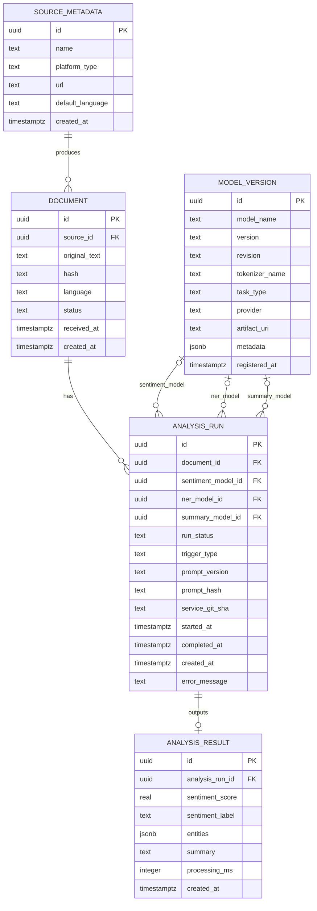

### Note
- `analysis_result.analysis_run_id` è `UNIQUE` e referenzia `analysis_run(id)` con `ON DELETE CASCADE`.
- `document.hash` ha un indice univoco parziale: unico solo quando non è `NULL`.
- `model_version` ha un vincolo `UNIQUE (model_name, version, revision, task_type, provider)`.
- I `DEFAULT` SQL e gli indici non sono rappresentati direttamente nel diagramma ER Mermaid.
